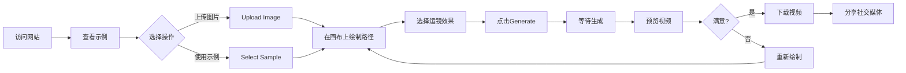

# Draw to Video MVP 需求文档

## 产品愿景
打造全球最简单的"画线变视频"工具，让任何人10秒内创建病毒级视频效果。

## MVP核心原则
- **极简至上**：3步完成，无学习成本
- **即时满足**：5-10秒生成结果
- **病毒基因**：自带社交传播属性
- **免费优先**：核心功能永久免费

---

## 🎯 MVP功能清单（P0级 - 必须有）

### 1. 绘画画布（Draw Canvas）
**功能描述**：用户在画布上绘制路径，定义相机运动轨迹

**具体要求**：
- 画布尺寸：自适应屏幕，最小800x600px
- 绘制工具：单一画笔，固定粗细
- 撤销/重做：支持最近5步操作
- 清空画布：一键清除所有内容
- 路径显示：实时显示绘制路径，带箭头指示方向

**交互细节**：
- 鼠标按下开始绘制
- 鼠标移动绘制路径
- 鼠标释放结束绘制
- 移动端支持触摸操作

### 2. 背景图片上传
**功能描述**：用户上传图片作为视频背景

**具体要求**：
- 支持格式：JPG、PNG、WebP
- 文件限制：最大10MB
- 预设图片：提供5张高质量示例图片
- 图片预览：上传后立即显示在画布背景

**优化点**：
- 自动压缩大图
- 智能裁剪适配画布

### 3. 运镜效果选择
**功能描述**：提供3种基础相机运动效果

**MVP效果列表**：
1. **Zoom In（推进）**
   - 沿路径向前推进
   - 速度：匀速
   - 适用：产品展示、细节放大

2. **Orbit（环绕）**
   - 沿路径环绕运动
   - 保持焦点在中心
   - 适用：360度展示

3. **Pull Back（拉远）**
   - 沿路径向后拉远
   - 逐渐显示全景
   - 适用：场景展示、大场面

**界面设计**：
- 卡片式选择
- 带动画预览图标
- 选中状态明显

### 4. 视频生成引擎
**功能描述**：将路径+图片+效果合成为视频

**技术要求**：
- 生成时长：5-10秒
- 分辨率：720p（MVP阶段）
- 帧率：24fps
- 格式：MP4（H.264编码）

**生成流程**：
1. 用户点击"Generate Video"
2. 显示加载动画（预计时间）
3. 后台处理（最多10秒）
4. 自动播放预览

### 5. 视频预览播放器
**功能描述**：生成后立即预览视频效果

**播放器功能**：
- 自动播放
- 循环播放
- 播放/暂停控制
- 音量控制（默认静音）
- 全屏按钮

**优化体验**：
- 加载时显示首帧
- 支持手势控制（移动端）

### 6. 下载功能
**功能描述**：一键下载生成的视频

**下载选项**：
- 格式：MP4
- 分辨率：720p
- 文件名：drawvideo_[timestamp].mp4
- 添加轻量水印（右下角小logo）

---

## 🎨 UI/UX设计规范

### 颜色方案
```css
--primary: #6366F1;      /* 主色 - 现代紫 */
--secondary: #10B981;    /* 成功色 - 绿 */
--accent: #F59E0B;       /* 强调色 - 橙 */
--background: #F8FAFC;   /* 背景 - 浅灰白 */
--canvas: #FFFFFF;       /* 画布 - 纯白 */
--text: #1E293B;         /* 文字 - 深灰 */
--border: #E2E8F0;       /* 边框 - 浅灰 */
```

### 字体规范
- 主字体：Inter（英文）
- 备选：system-ui, -apple-system
- 标题：24px, font-weight: 600
- 正文：16px, font-weight: 400
- 按钮：16px, font-weight: 500

### 布局结构
```
┌─────────────────────────────────────┐
│          Header (Logo + Menu)        │
├─────────────────────────────────────┤
│                                     │
│  ┌──────────┐     ┌──────────────┐ │
│  │          │     │              │ │
│  │  Canvas  │     │   Controls   │ │
│  │  (70%)   │     │    Panel     │ │
│  │          │     │    (30%)     │ │
│  └──────────┘     └──────────────┘ │
│                                     │
├─────────────────────────────────────┤
│      Generated Video Preview        │
└─────────────────────────────────────┘
```

### 响应式断点
- Desktop: ≥1024px（横向布局）
- Tablet: 768px-1023px（竖向布局）
- Mobile: <768px（单列布局）

---

## 📱 用户流程（User Flow）



---

## 🚀 性能要求

### 加载性能
- 首页加载：<2秒（FCP）
- 交互响应：<100ms
- 视频生成：<10秒

### 浏览器兼容
- Chrome 90+
- Safari 14+
- Firefox 88+
- Edge 90+
- Mobile Safari (iOS 14+)
- Chrome Mobile (Android 8+)

---

## 📊 数据追踪（Analytics）

### 核心指标
1. **使用漏斗**
   - 访问量
   - 开始绘制率
   - 生成完成率
   - 下载率

2. **用户行为**
   - 平均绘制时间
   - 最受欢迎效果
   - 重试次数

3. **性能指标**
   - 生成成功率
   - 平均生成时间
   - 错误率

### 事件追踪
```javascript
// 关键事件
- page_view
- start_drawing
- upload_image
- select_effect
- generate_video
- preview_video
- download_video
- share_video
```

---

## 🔒 技术限制（MVP阶段）

### 限制清单
1. **使用限制**
   - 免费用户：每天3个视频
   - 单个视频：最长5秒
   - 图片大小：最大10MB

2. **功能限制**
   - 不支持自定义时长
   - 不支持添加音频
   - 不支持多段路径
   - 不支持实时协作

3. **质量限制**
   - 仅720p输出
   - 固定24fps
   - 无高级特效

---

## ✅ 验收标准

### 功能验收
- [ ] 可以在画布上流畅绘制路径
- [ ] 可以上传并显示背景图片
- [ ] 3种运镜效果都能正常工作
- [ ] 10秒内生成视频
- [ ] 视频可以正常预览
- [ ] 视频可以成功下载

### 性能验收
- [ ] 页面加载时间<2秒
- [ ] 视频生成时间<10秒
- [ ] 无明显卡顿或崩溃

### 兼容性验收
- [ ] Chrome正常使用
- [ ] Safari正常使用
- [ ] 移动端可用

---

## 🎯 成功指标（上线1个月）

- 日活用户：500+
- 视频生成数：1000+/天
- 下载转化率：>30%
- 用户满意度：>4.0/5.0
- 页面停留时间：>3分钟

---

## 📝 未来功能储备（Post-MVP）

### Phase 2（1-2个月）
- 更多运镜效果（10+种）
- 自定义视频时长
- 批量生成
- 基础音效库

### Phase 3（3-6个月）
- AI智能路径建议
- 多段路径组合
- 高级特效（粒子、光效）
- 4K输出
- 团队协作功能

---

*文档版本：1.0*
*更新日期：2025年1月14日*