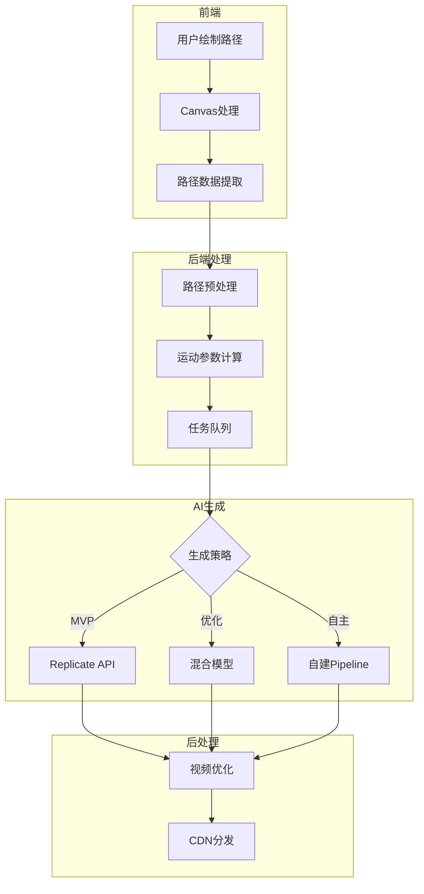

# Draw to Video 技术实现路线图 - 完整实操指南

## 📋 目录
1. [核心技术架构](#核心技术架构)
2. [Phase 1: MVP快速实现（第1-2周）](#phase-1-mvp快速实现第1-2周)
3. [Phase 2: 效果优化（第3-4周）](#phase-2-效果优化第3-4周)
4. [Phase 3: 成本优化（第2个月）](#phase-3-成本优化第2个月)
5. [Phase 4: 自主技术（第3-6个月）](#phase-4-自主技术第3-6个月)
6. [详细代码实现](#详细代码实现)
7. [部署与运维](#部署与运维)
8. [成本监控](#成本监控)

---

## 🏗️ 核心技术架构



---

## 📅 Phase 1: MVP快速实现（第1-2周）

### Week 1: 基础架构搭建

#### Day 1-2: 环境准备

```bash
# 1. 创建项目结构
mkdir -p draw-to-video/{frontend,backend,services,scripts,configs}
cd draw-to-video

# 2. 初始化后端
cd backend
python -m venv venv
source venv/bin/activate  # Windows: venv\Scripts\activate

# 3. 安装核心依赖
cat > requirements.txt << 'EOF'
fastapi==0.104.1
uvicorn==0.24.0
celery==5.3.4
redis==5.0.1
replicate==0.22.0
opencv-python==4.8.1.78
pillow==10.1.0
numpy==1.24.3
boto3==1.29.7
python-multipart==0.0.6
pydantic==2.5.0
python-dotenv==1.0.0
EOF

pip install -r requirements.txt

# 4. 配置环境变量
cat > .env << 'EOF'
REPLICATE_API_TOKEN=r8_xxxxxxxxxxxxx
REDIS_URL=redis://localhost:6379/0
AWS_ACCESS_KEY_ID=xxx
AWS_SECRET_ACCESS_KEY=xxx
S3_BUCKET_NAME=draw-to-video
CLOUDFLARE_ACCOUNT_ID=xxx
CLOUDFLARE_R2_ACCESS_KEY=xxx
CLOUDFLARE_R2_SECRET_KEY=xxx
EOF
```

#### Day 3-4: 核心API实现

```python
# backend/main.py
from fastapi import FastAPI, UploadFile, File, BackgroundTasks
from fastapi.middleware.cors import CORSMiddleware
from pydantic import BaseModel
from typing import List, Dict, Any
import uuid
import json
from services.video_generator import VideoGenerator
from services.storage import StorageService
from services.queue_manager import QueueManager

app = FastAPI()

# CORS配置
app.add_middleware(
    CORSMiddleware,
    allow_origins=["*"],
    allow_credentials=True,
    allow_methods=["*"],
    allow_headers=["*"],
)

# 初始化服务
video_gen = VideoGenerator()
storage = StorageService()
queue = QueueManager()

class GenerateRequest(BaseModel):
    image_url: str
    path_data: List[Dict[str, float]]
    effect_type: str = "zoom_in"
    duration: int = 5
    
class GenerateResponse(BaseModel):
    task_id: str
    status: str
    eta_seconds: int

@app.post("/api/generate", response_model=GenerateResponse)
async def generate_video(
    request: GenerateRequest,
    background_tasks: BackgroundTasks
):
    """生成视频的主API"""
    task_id = str(uuid.uuid4())
    
    # 添加到队列
    task_data = {
        "task_id": task_id,
        "image_url": request.image_url,
        "path_data": request.path_data,
        "effect_type": request.effect_type,
        "duration": request.duration
    }
    
    # 异步处理
    background_tasks.add_task(
        process_video_generation,
        task_data
    )
    
    # 立即返回任务ID
    return GenerateResponse(
        task_id=task_id,
        status="processing",
        eta_seconds=10
    )

async def process_video_generation(task_data: dict):
    """异步处理视频生成"""
    try:
        # 更新状态
        queue.update_status(task_data["task_id"], "processing")
        
        # 生成视频
        video_url = await video_gen.generate(
            image_url=task_data["image_url"],
            path_data=task_data["path_data"],
            effect_type=task_data["effect_type"]
        )
        
        # 上传到存储
        final_url = await storage.upload_video(video_url, task_data["task_id"])
        
        # 更新完成状态
        queue.update_status(
            task_data["task_id"], 
            "completed",
            {"video_url": final_url}
        )
        
    except Exception as e:
        queue.update_status(
            task_data["task_id"],
            "failed",
            {"error": str(e)}
        )

@app.get("/api/status/{task_id}")
async def get_status(task_id: str):
    """查询任务状态"""
    status = queue.get_status(task_id)
    return status

if __name__ == "__main__":
    import uvicorn
    uvicorn.run(app, host="0.0.0.0", port=8000)
```

#### Day 5: 视频生成服务实现

```python
# services/video_generator.py
import replicate
import os
import numpy as np
from PIL import Image
import cv2
import tempfile
from typing import List, Dict
import asyncio
import aiohttp

class VideoGenerator:
    def __init__(self):
        self.replicate_token = os.getenv("REPLICATE_API_TOKEN")
        os.environ["REPLICATE_API_TOKEN"] = self.replicate_token
        
    async def generate(
        self, 
        image_url: str, 
        path_data: List[Dict[str, float]], 
        effect_type: str
    ) -> str:
        """
        主生成函数 - MVP版本使用Replicate API
        """
        # Step 1: 下载并处理图片
        image = await self.download_image(image_url)
        
        # Step 2: 将路径转换为运动参数
        motion_params = self.path_to_motion_params(path_data, effect_type)
        
        # Step 3: 生成视频（使用Replicate）
        video_url = await self.generate_with_replicate(image, motion_params)
        
        return video_url
    
    async def download_image(self, url: str) -> Image.Image:
        """下载图片"""
        async with aiohttp.ClientSession() as session:
            async with session.get(url) as response:
                image_data = await response.read()
                image = Image.open(io.BytesIO(image_data))
                return image
    
    def path_to_motion_params(
        self, 
        path_data: List[Dict[str, float]], 
        effect_type: str
    ) -> Dict:
        """
        将用户绘制的路径转换为运动参数
        这是核心算法
        """
        params = {
            "effect_type": effect_type,
            "keyframes": [],
            "camera_path": []
        }
        
        # 采样关键点（每10个点取一个）
        sampled_points = path_data[::max(1, len(path_data)//10)]
        
        for i, point in enumerate(sampled_points):
            progress = i / len(sampled_points)
            
            if effect_type == "zoom_in":
                params["keyframes"].append({
                    "time": progress,
                    "zoom": 1.0 + progress * 2.0,  # 逐渐放大3倍
                    "x": point["x"],
                    "y": point["y"],
                    "rotation": 0
                })
                
            elif effect_type == "orbit":
                angle = progress * 360  # 完整旋转
                params["keyframes"].append({
                    "time": progress,
                    "zoom": 1.2,
                    "x": point["x"] + np.cos(np.radians(angle)) * 50,
                    "y": point["y"] + np.sin(np.radians(angle)) * 50,
                    "rotation": angle
                })
                
            elif effect_type == "pull_back":
                params["keyframes"].append({
                    "time": progress,
                    "zoom": 3.0 - progress * 2.0,  # 从3倍缩小到1倍
                    "x": point["x"],
                    "y": point["y"],
                    "rotation": 0
                })
        
        return params
    
    async def generate_with_replicate(
        self, 
        image: Image.Image, 
        motion_params: Dict
    ) -> str:
        """
        使用Replicate API生成视频
        MVP阶段使用stable-video-diffusion
        """
        # 保存图片到临时文件
        with tempfile.NamedTemporaryFile(suffix=".png", delete=False) as tmp:
            image.save(tmp.name)
            tmp_path = tmp.name
        
        try:
            # 调用Replicate API
            output = replicate.run(
                "stability-ai/stable-video-diffusion:3f0457e4619daac51203dedb472816fd4af51f3149fa7a9e0b5ffcf1b8172438",
                input={
                    "input_image": open(tmp_path, "rb"),
                    "video_length": "25_frames_with_svd_xt",
                    "sizing_strategy": "maintain_aspect_ratio",
                    "frames_per_second": 24,
                    "motion_bucket_id": self.calculate_motion_intensity(motion_params),
                    "cond_aug": 0.02,
                    "decoding_t": 7,
                    "seed": 42
                }
            )
            
            # 返回生成的视频URL
            return output
            
        finally:
            # 清理临时文件
            os.unlink(tmp_path)
    
    def calculate_motion_intensity(self, motion_params: Dict) -> int:
        """
        根据运动参数计算motion_bucket_id
        范围：1-255，值越大运动越强
        """
        effect_type = motion_params.get("effect_type", "zoom_in")
        
        intensity_map = {
            "zoom_in": 127,      # 中等运动
            "orbit": 180,        # 较强运动
            "pull_back": 100,    # 较弱运动
            "dramatic": 220,     # 强烈运动
            "subtle": 50         # 微妙运动
        }
        
        return intensity_map.get(effect_type, 127)
```

#### Day 6-7: 前端集成

```typescript
// frontend/components/VideoGenerator.tsx
import React, { useState, useRef } from 'react';
import axios from 'axios';

const API_URL = process.env.NEXT_PUBLIC_API_URL || 'http://localhost:8000';

export const VideoGenerator: React.FC = () => {
  const [isGenerating, setIsGenerating] = useState(false);
  const [videoUrl, setVideoUrl] = useState<string | null>(null);
  const [taskId, setTaskId] = useState<string | null>(null);
  const [progress, setProgress] = useState(0);
  
  const generateVideo = async (pathData: any[], imageUrl: string, effect: string) => {
    setIsGenerating(true);
    setProgress(0);
    
    try {
      // 1. 发起生成请求
      const response = await axios.post(`${API_URL}/api/generate`, {
        image_url: imageUrl,
        path_data: pathData,
        effect_type: effect,
        duration: 5
      });
      
      const { task_id } = response.data;
      setTaskId(task_id);
      
      // 2. 轮询状态
      const pollInterval = setInterval(async () => {
        const statusResponse = await axios.get(`${API_URL}/api/status/${task_id}`);
        const { status, result, progress: currentProgress } = statusResponse.data;
        
        setProgress(currentProgress || 50);
        
        if (status === 'completed') {
          clearInterval(pollInterval);
          setVideoUrl(result.video_url);
          setIsGenerating(false);
          setProgress(100);
        } else if (status === 'failed') {
          clearInterval(pollInterval);
          setIsGenerating(false);
          alert('Generation failed: ' + result.error);
        }
      }, 1000);
      
    } catch (error) {
      console.error('Generation error:', error);
      setIsGenerating(false);
    }
  };
  
  return (
    <div className="video-generator">
      {/* UI组件 */}
      {isGenerating && (
        <div className="progress-bar">
          <div 
            className="progress-fill" 
            style={{ width: `${progress}%` }}
          />
          <span>{progress}% - Generating magic...</span>
        </div>
      )}
      
      {videoUrl && (
        <video 
          src={videoUrl} 
          controls 
          autoPlay 
          loop 
          className="generated-video"
        />
      )}
    </div>
  );
};
```

### Week 2: 优化与测试

#### Day 8-9: 添加更多效果

```python
# services/effects_library.py
class EffectsLibrary:
    """预设效果库"""
    
    @staticmethod
    def get_effect_params(effect_name: str) -> Dict:
        """获取预设效果参数"""
        
        effects = {
            "earth_zoom_out": {
                "name": "Earth Zoom Out",
                "description": "TikTok viral effect",
                "motion_bucket_id": 200,
                "keyframe_pattern": "exponential_zoom_out",
                "duration": 5,
                "fps": 24
            },
            "eye_zoom": {
                "name": "Eye Zoom",
                "description": "Dramatic eye zoom effect",
                "motion_bucket_id": 150,
                "keyframe_pattern": "linear_zoom_in",
                "focus_point": "center",
                "duration": 3
            },
            "product_orbit": {
                "name": "Product 360",
                "description": "360 degree product showcase",
                "motion_bucket_id": 180,
                "keyframe_pattern": "circular_orbit",
                "revolutions": 1,
                "duration": 6
            },
            "parallax_slide": {
                "name": "Parallax Slide",
                "description": "Multi-layer parallax effect",
                "motion_bucket_id": 120,
                "keyframe_pattern": "horizontal_slide",
                "layers": 3,
                "duration": 4
            },
            "vertigo_effect": {
                "name": "Vertigo",
                "description": "Hitchcock zoom effect",
                "motion_bucket_id": 160,
                "keyframe_pattern": "dolly_zoom",
                "duration": 4
            }
        }
        
        return effects.get(effect_name, effects["earth_zoom_out"])
    
    @staticmethod
    def generate_keyframes(effect_name: str, path_data: List) -> List[Dict]:
        """根据效果生成关键帧"""
        
        effect = EffectsLibrary.get_effect_params(effect_name)
        pattern = effect["keyframe_pattern"]
        
        if pattern == "exponential_zoom_out":
            return EffectsLibrary._exponential_zoom_out(path_data)
        elif pattern == "linear_zoom_in":
            return EffectsLibrary._linear_zoom_in(path_data)
        elif pattern == "circular_orbit":
            return EffectsLibrary._circular_orbit(path_data)
        # ... 更多模式
    
    @staticmethod
    def _exponential_zoom_out(path_data: List) -> List[Dict]:
        """指数级拉远效果"""
        keyframes = []
        for i, point in enumerate(path_data[::5]):
            t = i / (len(path_data) // 5)
            zoom = 1.0 * (10 ** (t * 2))  # 指数增长到100倍
            keyframes.append({
                "time": t,
                "zoom": zoom,
                "x": point["x"],
                "y": point["y"],
                "rotation": 0,
                "easing": "ease-out"
            })
        return keyframes
```

#### Day 10-11: 性能优化

```python
# services/cache_manager.py
import redis
import hashlib
import json
from typing import Optional

class CacheManager:
    """缓存管理器 - 避免重复生成"""
    
    def __init__(self):
        self.redis_client = redis.from_url(os.getenv("REDIS_URL"))
        self.cache_ttl = 86400  # 24小时
    
    def get_cache_key(self, image_url: str, path_data: List, effect: str) -> str:
        """生成缓存键"""
        data_str = f"{image_url}:{json.dumps(path_data)}:{effect}"
        return hashlib.md5(data_str.encode()).hexdigest()
    
    def get_cached_video(self, image_url: str, path_data: List, effect: str) -> Optional[str]:
        """获取缓存的视频"""
        key = self.get_cache_key(image_url, path_data, effect)
        cached = self.redis_client.get(f"video:{key}")
        
        if cached:
            return cached.decode('utf-8')
        return None
    
    def cache_video(self, image_url: str, path_data: List, effect: str, video_url: str):
        """缓存生成的视频"""
        key = self.get_cache_key(image_url, path_data, effect)
        self.redis_client.setex(
            f"video:{key}",
            self.cache_ttl,
            video_url
        )

# 在VideoGenerator中使用缓存
class VideoGenerator:
    def __init__(self):
        self.cache = CacheManager()
        # ... 其他初始化
    
    async def generate(self, image_url: str, path_data: List, effect_type: str) -> str:
        # 先检查缓存
        cached = self.cache.get_cached_video(image_url, path_data, effect_type)
        if cached:
            return cached
        
        # 生成新视频
        video_url = await self._generate_new(image_url, path_data, effect_type)
        
        # 缓存结果
        self.cache.cache_video(image_url, path_data, effect_type, video_url)
        
        return video_url
```

#### Day 12-14: 测试与部署

```yaml
# docker-compose.yml
version: '3.8'

services:
  backend:
    build: ./backend
    ports:
      - "8000:8000"
    environment:
      - REPLICATE_API_TOKEN=${REPLICATE_API_TOKEN}
      - REDIS_URL=redis://redis:6379/0
      - S3_BUCKET_NAME=${S3_BUCKET_NAME}
    depends_on:
      - redis
    volumes:
      - ./backend:/app
    command: uvicorn main:app --host 0.0.0.0 --port 8000 --reload

  redis:
    image: redis:7-alpine
    ports:
      - "6379:6379"
    volumes:
      - redis_data:/data

  nginx:
    image: nginx:alpine
    ports:
      - "80:80"
      - "443:443"
    volumes:
      - ./nginx.conf:/etc/nginx/nginx.conf
      - ./ssl:/etc/nginx/ssl
    depends_on:
      - backend

volumes:
  redis_data:
```

---

## 🚀 Phase 2: 效果优化（第3-4周）

### Week 3: 混合模型方案

#### 实现多模型组合

```python
# services/hybrid_generator.py
import asyncio
from typing import List, Dict
import numpy as np

class HybridVideoGenerator:
    """混合多个AI模型以获得更好效果"""
    
    def __init__(self):
        self.models = {
            "base": "stability-ai/stable-video-diffusion",
            "motion": "lucataco/animate-diff",
            "upscale": "nightmareai/real-esrgan"
        }
    
    async def generate_advanced(
        self,
        image: Image.Image,
        path_data: List[Dict],
        effect_type: str
    ) -> str:
        """
        高级生成流程：
        1. 使用SD生成基础视频
        2. 使用AnimateDiff增强运动
        3. 使用ESRGAN提升质量
        """
        
        # Step 1: 生成多个变体
        variants = await self.generate_variants(image, path_data)
        
        # Step 2: 智能混合
        blended = await self.blend_variants(variants)
        
        # Step 3: 后处理增强
        enhanced = await self.enhance_video(blended)
        
        return enhanced
    
    async def generate_variants(self, image, path_data):
        """并行生成多个变体"""
        tasks = []
        
        # 不同强度的运动
        for intensity in [100, 150, 200]:
            task = self.generate_single_variant(image, path_data, intensity)
            tasks.append(task)
        
        variants = await asyncio.gather(*tasks)
        return variants
    
    async def blend_variants(self, variants: List) -> str:
        """智能混合多个变体"""
        # 使用OpenCV混合视频
        import cv2
        
        # 读取所有视频帧
        all_frames = []
        for variant_url in variants:
            frames = self.extract_frames(variant_url)
            all_frames.append(frames)
        
        # 智能混合算法
        blended_frames = []
        for i in range(len(all_frames[0])):
            # 获取每个变体的第i帧
            frames_at_i = [frames[i] for frames in all_frames]
            
            # 加权平均（可以根据质量评分调整权重）
            weights = [0.5, 0.3, 0.2]  # 主变体权重更高
            blended = np.average(frames_at_i, axis=0, weights=weights)
            
            blended_frames.append(blended.astype(np.uint8))
        
        # 编码为视频
        output_path = self.frames_to_video(blended_frames)
        return output_path
```

### Week 4: 自定义运动控制

#### 实现精确的相机运动控制

```python
# services/camera_controller.py
import numpy as np
from scipy import interpolate
from typing import List, Tuple

class CameraController:
    """精确控制相机运动"""
    
    def __init__(self):
        self.fps = 24
        self.resolution = (1920, 1080)
    
    def path_to_camera_trajectory(
        self,
        path_points: List[Dict],
        duration: float,
        effect_type: str
    ) -> List[Dict]:
        """
        将2D路径转换为3D相机轨迹
        返回每一帧的相机参数
        """
        
        total_frames = int(self.fps * duration)
        
        # 提取x, y坐标
        x_coords = [p['x'] for p in path_points]
        y_coords = [p['y'] for p in path_points]
        
        # 创建平滑插值
        t = np.linspace(0, 1, len(path_points))
        t_new = np.linspace(0, 1, total_frames)
        
        # 使用三次样条插值
        fx = interpolate.interp1d(t, x_coords, kind='cubic')
        fy = interpolate.interp1d(t, y_coords, kind='cubic')
        
        # 生成平滑路径
        smooth_x = fx(t_new)
        smooth_y = fy(t_new)
        
        # 根据效果类型生成相机参数
        camera_params = []
        for i in range(total_frames):
            progress = i / total_frames
            
            param = self.calculate_camera_param(
                smooth_x[i],
                smooth_y[i],
                progress,
                effect_type
            )
            
            camera_params.append(param)
        
        return camera_params
    
    def calculate_camera_param(
        self,
        x: float,
        y: float,
        progress: float,
        effect_type: str
    ) -> Dict:
        """计算单帧的相机参数"""
        
        if effect_type == "zoom_in":
            return {
                "position": [x, y, -100 + progress * 90],  # Z轴推进
                "target": [x, y, 0],  # 看向当前点
                "up": [0, 1, 0],
                "fov": 60 - progress * 30,  # FOV缩小实现zoom
                "roll": 0
            }
            
        elif effect_type == "orbit":
            angle = progress * 2 * np.pi
            radius = 100
            return {
                "position": [
                    x + radius * np.cos(angle),
                    y,
                    radius * np.sin(angle)
                ],
                "target": [x, y, 0],
                "up": [0, 1, 0],
                "fov": 45,
                "roll": 0
            }
            
        elif effect_type == "dolly_zoom":
            # Vertigo效果
            zoom = 1 + progress * 2
            return {
                "position": [x, y, -100 * zoom],
                "target": [x, y, 0],
                "up": [0, 1, 0],
                "fov": 60 / zoom,  # 反向调整FOV
                "roll": 0
            }
        
        # 默认参数
        return {
            "position": [x, y, -100],
            "target": [0, 0, 0],
            "up": [0, 1, 0],
            "fov": 60,
            "roll": 0
        }
    
    def apply_camera_to_image(
        self,
        image: np.ndarray,
        camera_param: Dict
    ) -> np.ndarray:
        """
        将相机参数应用到图像
        使用透视变换模拟相机运动
        """
        
        h, w = image.shape[:2]
        
        # 计算透视变换矩阵
        src_points = np.float32([[0, 0], [w, 0], [w, h], [0, h]])
        
        # 根据相机参数计算目标点
        zoom = camera_param.get('fov', 60) / 60
        pos = camera_param['position']
        
        # 简化的透视变换
        offset_x = pos[0] * 2
        offset_y = pos[1] * 2
        scale = 1 / (1 + pos[2] / 100)
        
        dst_points = np.float32([
            [offset_x, offset_y],
            [w * scale + offset_x, offset_y * scale],
            [w * scale + offset_x, h * scale + offset_y],
            [offset_x, h * scale + offset_y]
        ])
        
        # 计算透视变换矩阵
        M = cv2.getPerspectiveTransform(src_points, dst_points)
        
        # 应用变换
        warped = cv2.warpPerspective(image, M, (w, h))
        
        return warped
```

---

## 💰 Phase 3: 成本优化（第2个月）

### 自建推理服务

#### 使用Modal.com部署（Serverless GPU）

```python
# deploy/modal_deployment.py
import modal

stub = modal.Stub("draw-to-video")

# 定义GPU环境
gpu_image = (
    modal.Image.debian_slim()
    .pip_install(
        "torch==2.0.1",
        "transformers==4.35.0",
        "diffusers==0.24.0",
        "accelerate==0.24.0",
        "opencv-python==4.8.1.78",
        "pillow==10.1.0"
    )
    .run_commands("apt-get update && apt-get install -y ffmpeg")
)

@stub.function(
    image=gpu_image,
    gpu="T4",  # 使用T4 GPU，成本较低
    timeout=300,
    concurrency_limit=10
)
def generate_video_modal(image_data: bytes, motion_params: dict) -> bytes:
    """在Modal上运行的视频生成函数"""
    
    import torch
    from diffusers import StableVideoDiffusionPipeline
    from PIL import Image
    import io
    
    # 加载模型（会被缓存）
    pipe = StableVideoDiffusionPipeline.from_pretrained(
        "stabilityai/stable-video-diffusion-img2vid-xt",
        torch_dtype=torch.float16,
        variant="fp16"
    )
    pipe = pipe.to("cuda")
    
    # 处理输入图像
    image = Image.open(io.BytesIO(image_data))
    
    # 生成视频
    frames = pipe(
        image,
        num_frames=25,
        decode_chunk_size=8,
        motion_bucket_id=motion_params.get("intensity", 127)
    ).frames
    
    # 转换为视频字节
    video_bytes = frames_to_video_bytes(frames)
    
    return video_bytes

@stub.local_entrypoint()
def main():
    """部署入口"""
    print("Deploying to Modal...")
    
    # 测试函数
    with open("test_image.jpg", "rb") as f:
        image_data = f.read()
    
    result = generate_video_modal.remote(
        image_data,
        {"intensity": 150}
    )
    
    print(f"Generated video size: {len(result)} bytes")
```

#### 使用Runpod部署（持久GPU）

```python
# deploy/runpod_deployment.py
import runpod
import os

# Runpod处理函数
def handler(job):
    """Runpod serverless处理函数"""
    
    job_input = job["input"]
    image_url = job_input["image_url"]
    motion_params = job_input["motion_params"]
    
    try:
        # 生成视频
        result = generate_video_local(image_url, motion_params)
        
        return {
            "output": result,
            "status": "success"
        }
    except Exception as e:
        return {
            "error": str(e),
            "status": "failed"
        }

def generate_video_local(image_url: str, motion_params: dict):
    """本地GPU生成函数"""
    
    # 这里运行实际的模型
    from diffusers import StableVideoDiffusionPipeline
    import torch
    
    # 模型会被持久化在pod中
    if not hasattr(generate_video_local, 'pipe'):
        generate_video_local.pipe = StableVideoDiffusionPipeline.from_pretrained(
            "stabilityai/stable-video-diffusion-img2vid-xt",
            torch_dtype=torch.float16
        ).to("cuda")
    
    pipe = generate_video_local.pipe
    
    # 生成视频
    # ... 实际生成代码
    
    return video_url

# 启动Runpod服务
runpod.serverless.start({
    "handler": handler
})
```

### 成本对比与监控

```python
# services/cost_monitor.py
import time
from datetime import datetime, timedelta
from typing import Dict

class CostMonitor:
    """成本监控服务"""
    
    def __init__(self):
        self.costs = {
            "replicate": 0.001,  # 每秒
            "modal": 0.0003,     # 每秒
            "runpod": 0.0002,    # 每秒
            "self_hosted": 0.00005  # 每秒（仅电费）
        }
        self.usage_log = []
    
    def track_usage(
        self,
        service: str,
        duration_seconds: float,
        task_id: str
    ):
        """记录使用情况"""
        cost = self.costs.get(service, 0) * duration_seconds
        
        self.usage_log.append({
            "timestamp": datetime.now(),
            "service": service,
            "duration": duration_seconds,
            "cost": cost,
            "task_id": task_id
        })
        
        # 检查是否需要切换服务
        self.check_cost_optimization()
    
    def check_cost_optimization(self):
        """检查是否需要切换到更便宜的服务"""
        
        # 计算最近一小时的成本
        one_hour_ago = datetime.now() - timedelta(hours=1)
        recent_usage = [
            log for log in self.usage_log 
            if log["timestamp"] > one_hour_ago
        ]
        
        total_cost = sum(log["cost"] for log in recent_usage)
        
        # 如果成本超过阈值，切换服务
        if total_cost > 10:  # $10/小时
            self.recommend_service_switch()
    
    def recommend_service_switch(self):
        """推荐服务切换"""
        print("⚠️ 成本警告：建议切换到自建服务")
        # 发送通知
        self.send_alert({
            "type": "cost_alert",
            "message": "Hourly cost exceeded $10",
            "recommendation": "Switch to self-hosted"
        })
    
    def get_cost_report(self, period_days: int = 7) -> Dict:
        """生成成本报告"""
        cutoff = datetime.now() - timedelta(days=period_days)
        period_logs = [
            log for log in self.usage_log
            if log["timestamp"] > cutoff
        ]
        
        # 按服务分组统计
        service_costs = {}
        for log in period_logs:
            service = log["service"]
            if service not in service_costs:
                service_costs[service] = {
                    "count": 0,
                    "total_cost": 0,
                    "total_duration": 0
                }
            
            service_costs[service]["count"] += 1
            service_costs[service]["total_cost"] += log["cost"]
            service_costs[service]["total_duration"] += log["duration"]
        
        return {
            "period_days": period_days,
            "total_cost": sum(s["total_cost"] for s in service_costs.values()),
            "total_videos": sum(s["count"] for s in service_costs.values()),
            "by_service": service_costs,
            "recommendations": self.get_recommendations(service_costs)
        }
    
    def get_recommendations(self, service_costs: Dict) -> List[str]:
        """获取优化建议"""
        recommendations = []
        
        total_cost = sum(s["total_cost"] for s in service_costs.values())
        
        if total_cost > 100:
            recommendations.append("Consider self-hosting for cost reduction")
        
        if "replicate" in service_costs and service_costs["replicate"]["count"] > 1000:
            recommendations.append("High Replicate usage - switch to Modal for 70% cost reduction")
        
        return recommendations
```

---

## 🚀 Phase 4: 自主技术（第3-6个月）

### 构建自己的视频生成Pipeline

```python
# services/custom_pipeline.py
import torch
from diffusers import DiffusionPipeline, UNet2DConditionModel
from transformers import CLIPTextModel, CLIPTokenizer
import numpy as np

class CustomVideoPipeline:
    """自研视频生成管线"""
    
    def __init__(self):
        self.device = "cuda" if torch.cuda.is_available() else "cpu"
        self.load_models()
    
    def load_models(self):
        """加载和配置模型"""
        
        # 基础模型
        self.base_model = DiffusionPipeline.from_pretrained(
            "stabilityai/stable-diffusion-2-1",
            torch_dtype=torch.float16
        ).to(self.device)
        
        # 运动模块（自训练或开源）
        self.motion_module = self.load_motion_module()
        
        # 时序一致性模块
        self.temporal_module = self.load_temporal_module()
    
    def load_motion_module(self):
        """加载运动控制模块"""
        # 可以使用AnimateDiff的权重
        # 或者自己训练的模块
        pass
    
    def generate_video(
        self,
        image: Image.Image,
        motion_params: Dict,
        num_frames: int = 25
    ) -> List[np.ndarray]:
        """生成视频帧"""
        
        frames = []
        
        # 编码初始图像
        latents = self.encode_image(image)
        
        for i in range(num_frames):
            # 计算当前帧的运动偏移
            motion_offset = self.calculate_motion(motion_params, i / num_frames)
            
            # 应用运动到潜在空间
            moved_latents = self.apply_motion(latents, motion_offset)
            
            # 解码为图像
            frame = self.decode_latents(moved_latents)
            
            # 应用时序一致性
            if i > 0:
                frame = self.apply_temporal_consistency(frame, frames[-1])
            
            frames.append(frame)
        
        return frames
    
    def train_on_custom_data(self, dataset_path: str):
        """在自定义数据集上训练"""
        
        # 加载数据集
        dataset = self.load_video_dataset(dataset_path)
        
        # 训练配置
        training_config = {
            "learning_rate": 1e-5,
            "batch_size": 4,
            "num_epochs": 100,
            "gradient_accumulation_steps": 4
        }
        
        # 训练循环
        optimizer = torch.optim.AdamW(
            self.motion_module.parameters(),
            lr=training_config["learning_rate"]
        )
        
        for epoch in range(training_config["num_epochs"]):
            for batch in dataset:
                # 前向传播
                loss = self.compute_loss(batch)
                
                # 反向传播
                loss.backward()
                
                # 更新权重
                optimizer.step()
                optimizer.zero_grad()
                
                print(f"Epoch {epoch}, Loss: {loss.item()}")
```

---

## 📊 监控与分析

### 实时监控Dashboard

```python
# monitoring/metrics_dashboard.py
from fastapi import FastAPI, WebSocket
from datetime import datetime
import json
import asyncio

app = FastAPI()

class MetricsCollector:
    def __init__(self):
        self.metrics = {
            "total_generated": 0,
            "success_rate": 100.0,
            "avg_generation_time": 0,
            "active_tasks": 0,
            "cost_today": 0,
            "errors_today": []
        }
        self.websocket_clients = []
    
    async def update_metric(self, metric_name: str, value: any):
        """更新指标"""
        self.metrics[metric_name] = value
        
        # 广播到所有WebSocket客户端
        await self.broadcast_update()
    
    async def broadcast_update(self):
        """广播更新到所有客户端"""
        message = json.dumps({
            "timestamp": datetime.now().isoformat(),
            "metrics": self.metrics
        })
        
        for client in self.websocket_clients:
            await client.send_text(message)

metrics = MetricsCollector()

@app.websocket("/ws/metrics")
async def websocket_metrics(websocket: WebSocket):
    """WebSocket端点for实时指标"""
    await websocket.accept()
    metrics.websocket_clients.append(websocket)
    
    try:
        while True:
            # 保持连接
            await websocket.receive_text()
    except:
        metrics.websocket_clients.remove(websocket)

@app.get("/api/metrics/summary")
async def get_metrics_summary():
    """获取指标摘要"""
    return {
        "metrics": metrics.metrics,
        "timestamp": datetime.now().isoformat()
    }
```

---

## 🚢 部署与运维

### 生产环境部署

```yaml
# kubernetes/deployment.yaml
apiVersion: apps/v1
kind: Deployment
metadata:
  name: draw-to-video-api
spec:
  replicas: 3
  selector:
    matchLabels:
      app: draw-to-video
  template:
    metadata:
      labels:
        app: draw-to-video
    spec:
      containers:
      - name: api
        image: drawtovideo/api:latest
        ports:
        - containerPort: 8000
        env:
        - name: REPLICATE_API_TOKEN
          valueFrom:
            secretKeyRef:
              name: api-secrets
              key: replicate-token
        resources:
          requests:
            memory: "2Gi"
            cpu: "1000m"
          limits:
            memory: "4Gi"
            cpu: "2000m"
---
apiVersion: v1
kind: Service
metadata:
  name: draw-to-video-service
spec:
  selector:
    app: draw-to-video
  ports:
    - port: 80
      targetPort: 8000
  type: LoadBalancer
```

### CI/CD Pipeline

```yaml
# .github/workflows/deploy.yml
name: Deploy to Production

on:
  push:
    branches: [main]

jobs:
  test:
    runs-on: ubuntu-latest
    steps:
      - uses: actions/checkout@v2
      - name: Run tests
        run: |
          pip install -r requirements.txt
          pytest tests/

  deploy:
    needs: test
    runs-on: ubuntu-latest
    steps:
      - uses: actions/checkout@v2
      
      - name: Build Docker image
        run: |
          docker build -t drawtovideo/api:${{ github.sha }} .
          docker tag drawtovideo/api:${{ github.sha }} drawtovideo/api:latest
      
      - name: Push to registry
        run: |
          echo ${{ secrets.DOCKER_PASSWORD }} | docker login -u ${{ secrets.DOCKER_USERNAME }} --password-stdin
          docker push drawtovideo/api:${{ github.sha }}
          docker push drawtovideo/api:latest
      
      - name: Deploy to Kubernetes
        run: |
          kubectl apply -f kubernetes/
          kubectl set image deployment/draw-to-video-api api=drawtovideo/api:${{ github.sha }}
```

---

## 💰 成本监控与优化

### 实时成本追踪

```python
# cost_tracking.py
class CostTracker:
    def __init__(self):
        self.cost_per_service = {
            "replicate": {"per_second": 0.001, "total": 0},
            "modal": {"per_second": 0.0003, "total": 0},
            "self_hosted": {"per_second": 0.00005, "total": 0}
        }
        
    def get_daily_report(self):
        """每日成本报告"""
        return {
            "date": datetime.now().date(),
            "total_cost": sum(s["total"] for s in self.cost_per_service.values()),
            "by_service": self.cost_per_service,
            "projections": {
                "monthly": self.project_monthly_cost(),
                "yearly": self.project_yearly_cost()
            },
            "recommendations": self.get_cost_recommendations()
        }
```

---

## 📈 成功指标

### KPI追踪

```python
kpis = {
    "week_1": {
        "videos_generated": 100,
        "success_rate": 95,
        "avg_generation_time": 15,
        "cost_per_video": 0.05
    },
    "week_2": {
        "videos_generated": 1000,
        "success_rate": 98,
        "avg_generation_time": 12,
        "cost_per_video": 0.03
    },
    "month_1": {
        "videos_generated": 10000,
        "success_rate": 99,
        "avg_generation_time": 10,
        "cost_per_video": 0.01
    },
    "month_3": {
        "videos_generated": 100000,
        "success_rate": 99.5,
        "avg_generation_time": 8,
        "cost_per_video": 0.005
    }
}
```

---

## ✅ 实施检查清单

### Phase 1 检查点
- [ ] Replicate API集成完成
- [ ] 基础路径转运动算法实现
- [ ] 3种基础效果可用
- [ ] 视频生成时间 < 15秒
- [ ] 成功率 > 90%

### Phase 2 检查点
- [ ] 缓存系统运行正常
- [ ] 5+种效果模板
- [ ] 混合模型方案测试
- [ ] 生成时间 < 10秒
- [ ] 成功率 > 95%

### Phase 3 检查点
- [ ] Modal/Runpod部署完成
- [ ] 成本降低 > 50%
- [ ] 自动服务切换逻辑
- [ ] 实时成本监控
- [ ] 生成时间 < 8秒

### Phase 4 检查点
- [ ] 自研Pipeline运行
- [ ] 成本 < $0.01/视频
- [ ] 质量匹配Higgsfield
- [ ] 独特效果3+种
- [ ] 完全技术自主

---

## 🎯 总结

这个实施方案的核心优势：

1. **快速启动** - 第一周即可上线MVP
2. **逐步优化** - 从API到自建，平滑过渡
3. **成本可控** - 多种方案，灵活切换
4. **技术积累** - 最终实现技术独立

记住：**先上线，再优化**。不要一开始就追求完美，而是快速验证市场，然后持续改进。

---

*文档版本：2.0*
*更新日期：2025年1月14日*
*预计完成时间：3-6个月达到技术独立*